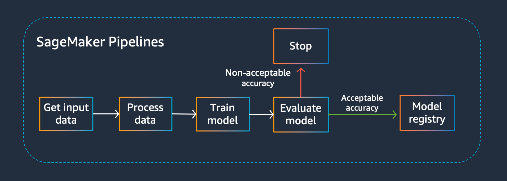
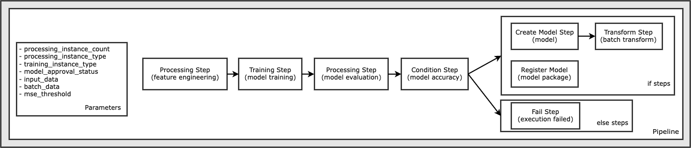
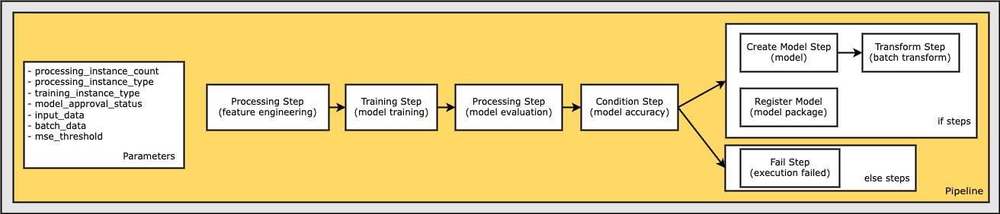

# SageMaker pipelines 
Testing with Fraud detection data sameple. 
The project was deploy with offline mode for saving costs. After that, the pipeline will be deploy with online mode (SageMaker)

## 1. Pipeline Structure

An Amazon SageMaker Model Building Pipelines instance is composed of three components:

Name: Unique (account, region)

Parameters: input parameters specified when triggering a pipeline execution. They need to be explicitly defined when creating the pipeline and contain default values.

Steps: define the actions that the pipeline takes and the relationships between steps using properties



## 2. Orchestrate Jobs example

Follows a typical machine learning (ML) application pattern of preprocessing, training, evaluation, model creation, batch transformation, and model registration



### **Set up session**
  
  * Define the pipeline will be run on **offline or cloud**
  * Define **region**
  * Define **the bucket** that contains input data, script, output data
  * Define **Role** which SageMaker use to run the pipeline

* **Upload Input data to default bucket**
  * Upload file from local to S3 default bucket
* **Configuration the parameterize of pipeline**
  * Define total of instances each step
  * Define the instance type
  * Define Input data
  * Define MSE Threshold
  * Define Framework (SKLearn)
    * Using **SKLearn** to:
      * Fill missing values
      * Scale and normalize the fields
      * Split data into training, validation and test datasets

### **Set up pipeline**

* **Pre-processing step** (`step_process`)
  * Using **SKLearn** to cleansing data, handle string datatype, numeric datatype, split data into 3 datasets (train, validation, test)
  * The dataset will be **pull from S3 default bucket and store in instance storage**
  * The script to split datasets was stored on S3 default bucket or notebook [Example code](code/preprocessing.py)
  
* **Train step** (`step_train`)
  * Define the Algorithm to train
  * Set up hyperparameters to tuning model
  * [Example code](code/abalone.py)

* **Evaluation step** (`step_eval`)
  * Load the model.
  * Read the test data.
  * Issue predictions against the test data.
  * Build a classification report, including accuracy and ROC curve.
  * Save the evaluation report to the evaluation directory.
  * [Example code](code/evaluation.py)

* **Condition step**
  * We define the failed model if the metric on `EvaluationStep` over the `threshold` 
  * **Example**: We defined the `threshold of MSE` is `7.0`. After `EvaluationStep`, if we have MSE value is `8.0`, the current model is `failed`, otherwise if we have MSE value is `6.0`, we will register the `Model` to `Model Package`
  * If passed
    * **Create Model step**
      * Create Model to **Batch Transformation**
    
    * **Transform step**
      * Using the created model to Batch Transformation
      * Output data can stored locally or S3 bucket (JSON, CSV,...)

  * Failed (MSE > threshold)

    * **Handle Fail step**
      * Notification the errors and end of pipeline
      

## Define a Pipeline of Parameters, Steps, and Conditions

 A pipeline requires a name, parameters, and steps. Names must be unique within an (account, region).
**
Note:**

* All the parameters used in the definitions must be present.
* Steps passed into the pipeline do not have to be listed in the order of execution. The SageMaker Pipeline service resolves the data dependency DAG as steps for the execution to complete.
* Steps must be unique to across the pipeline step list and all condition step if/else lists.



```
from sagemaker.workflow.pipeline import Pipeline

pipeline_name = f"LocalModelPipeline"
pipeline = Pipeline(
    name=pipeline_name,
    parameters=[
        input_data,
        mse_threshold,
    ],
    steps=[step_process, step_train, step_eval, step_cond],
    sagemaker_session=local_pipeline_session,
)
```

After the pipeline is defined, we can apply to SageMaker and running the pipeline on Cloud or locally